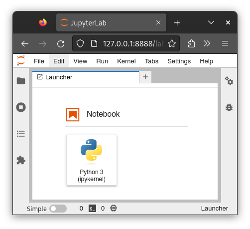
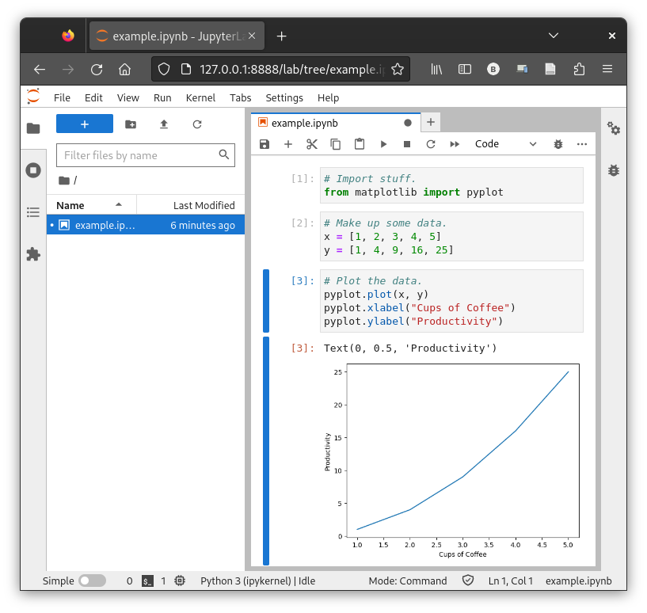

[Jupyter](https://jupyter.org/) and the Jupyter Lab notebook interface are a widely-used open-source project for interactive, reproducible computing. They are widely used by data scientists. For example, Jupyter powers [Google Colab](https://colab.research.google.com/) and the automatic manuscript figure rendering in [Quarto](https://quarto.org/). Jupyter is written in Python but supports many data science languages including R, Julia, and Matlab.

You can run a Jupyter Lab server as a cluster job and connect to it using a web browser on your local computer. This setup is very convenient for interacting with large data sets and computational expensive operations that would grind your laptop to a halt. It's also a great way to incrementally develop batch jobs to run on the cluster.

## Setting Up a Worker Node

Log into the cluster and use [`salloc`](https://slurm.schedmd.com/salloc.html) to request an interactive job with reasonable resources. Here we ask for 4 GB of memory, which should be enough for basic Python work, and 3 hours of runtime, which is the maximum allowed under the free tier. Take note of which node the job runs on.

```
[localuser@localmachine ~]$ ssh login3.chpc.wustl.edu
Last login: Tue Sep 19 14:15:38 2023 from 10.20.145.192
[clusteruser@login02 ~]$ salloc --nodes=1 --time=3:00:00 --mem=4GB --qos=interactive
salloc: Nodes node31 are ready for job
[clusteruser@node31 ~]$ 
```

You can also figure out which worker node your job is running on with [`squeue`](https://slurm.schedmd.com/squeue.html).

```
[clusteruser@login02 ~] squeue -u clusteruser -t running
JOBID      PARTITION    NAME        USER           ST    TIME    NODES    NODELIST(REASON)
4074089    small        interact    clusteruser    R     7:58    1        node31
```

And when you are finished working, you can cancel the job.

```
[clusteruser@login02 ~] scancel 4074089 # use job id from squeue
```

## Starting a Server

Start a Jupyter Lab server from your interactive job on the worker node. First you will need to load the python Slurm module. Append this line to your `~/.bashrc` to avoid having to run it each time you log in.

```
[clusteruser@node31] module load python
```

Then you can start a Jupyter Lab server using the system-wide Python environment. For a [full list of options](https://jupyter-server.readthedocs.io/en/latest/other/full-config.html) see `jupyter lab --help-all`.

- `allow_remote_access=True` allows you to connect from your local machine. Otherwise you would need to run a web browser from an interactive Desktop session on the worker node.
- `ip=$(hostname)` causes the Jupyter Lab server to listen on the subnet-public IP address (e.g. 10.3.1.31 for node 31) instead of just 127.0.0.1, another prerequisite for you to connect from your local machine.
- `open_browser=False` tells jupyter not to try to open a web browser on the worker node. You will open a web browser on your local machine instead.

```
[clusteruser@node31 ~]$ jupyter lab \
--ServerApp.allow_remote_access=True \
--ServerApp.ip=$(hostname) \
--ServerApp.open_browser=False
```

You will see a lot of output ending in something like this:

```
To access the server, open this file in a browser:
    file:///ceph/chpc/home/clusteruser/.local/share/jupyter/runtime/jpserver-3437668-open.html
Or copy and paste one of these URLs:
    http://node31:8888/lab?token=f43fc437c5bc23e4b1606808651a09895737ef3b11ab56d4
  or http://127.0.0.1:8888/lab?token=f43fc437c5bc23e4b1606808651a09895737ef3b11ab56d4
```

Copy the _entire_ URL starting with `http://127.0.0.1:8888/` to your clipboard and note the port number, here 8888. Jupyter will try to bind to port 8888 and keep incrementing the number until it finds an open port.

> Note: You can request a fixed port number with: `--ServerApp.port=8888`

Open an ssh tunnel from some port (the first 8888) on your local machine to whichever port jupyter is listening on (the second 8888) on the worker node (e.g. node31).

```
[localuser@localmachine ~]$ ssh -L 8888:node31:8888 login3.chpc.wustl.edu
```

Then paste the URL into your local computer's web browser. You should see something like this. Congratulations, you are running Jupyter Lab on the cluster!



Python code in the Jupyter notebook will run on the worker node, and results will be rendered in your local machine's web browser. For example:



When you are finished, close your web browser and, on the worker node, press `Ctrl + C`. You will be promped with:

```
Shutdown this Jupyter server (y/[n])?
```

Enter `y` and you should see the server shut down.

```
Shutdown this Jupyter server (y/[n])? y
[C 2023-09-25 13:57:57.387 ServerApp] Shutdown confirmed
[I 2023-09-25 13:57:57.425 ServerApp] Shutting down 4 extensions
[I 2023-09-25 13:57:57.426 ServerApp] Shutting down 1 kernel
[I 2023-09-25 13:57:57.426 ServerApp] Kernel shutdown: 9c05c4d2-c5b7-4e0b-819b-d2b2cd984d83
[I 2023-09-25 13:57:58.163 ServerApp] Shutting down 0 terminals
[clusteruser@node31 ~]$
```

## Keeping an Interactive Job Alive With Screen

Should you accidentally lose the interactive ssh connection to the worker node your Jupyter Lab server may shut down. To keep it open, use a terminal multiplexer like [screen](https://www.gnu.org/software/screen/manual/screen.html) or [tmux](https://github.com/tmux/tmux/wiki) to keep the terminal connection going in the background. For example:

```
[clusteruser@node31 ~]$ screen -S jupyter # can use any name
[clusteruser@node31 ~]$ jupyter lab
# output from jupyter server...
```

Then press `Ctrl + A` followed by `d` to "detach" from the terminal. You can use screen to "reattach" to the named terminal.

```
[clusteruser@node31 ~]$ # detached from terminal
[clusteruser@node31 ~]$ # jupyter is running in the background
[clusteruser@node31 ~]$ screen -r jupyter
# reattached to terminal
# press Ctrl + C to kill the server
# press Ctrl + A, then d to detach again
```

## Running Jupyter as a Batch Job

Instead of starting an interactive job with `salloc --qos=interactive` you may submit a batch job that automatically starts Jupyter. Create a slurm script like this one and give it a name like `jupyter.sh`. Make the script executable with `chmod u+x jupyter.sh`.

```bash
#!/bin/bash
#SBATCH --job-name=jupyter
#SBATCH --nodes=1
#SBATCH --time=3:00:00
#SBATCH --mem=4GB
pwd; hostname; date # for logging purposes
module load python

jupyter lab \
--ServerApp.allow_remote_access=True \
--ServerApp.ip=$(hostname) \
--ServerApp.open_browser=False
```

Submit your job with `sbatch` and then check to see if it is running with `squeue`.

```
[clusteruser@login01 ~]$ sbatch jupyter.sh
Submitted batch job 4089300
[clusteruser@login02 ~] squeue -u clusteruser -t running
JOBID      PARTITION    NAME        USER           ST    TIME    NODES    NODELIST(REASON)
4089300    small        interact    clusteruser    R     0:10    1        node15
```

Inspect the job's slurm output to get the URL to connect to the Jupyter Lab server. Note the port number in the URL.

```
[clusteruser@login01 ~]$ egrep -o 'http(s)?://127.0.0.1:[0-9]+/lab\?token=.+$' slurm-4089300.out 
http://127.0.0.1:8888/lab?token=a0237c01c8c25c3e443e6060f088013935b72955056ce6be
```

Open an ssh tunnel to the appropriate worker node and port.

```
[localuser@localmachine ~]$ ssh -L 8888:node15:8888 login3.chpc.wustl.edu
```

Now you can copy and paste the Jupyter URL into your web browser and use your notebook. When you are done, close your web browser, `exit` the ssh tunnel, and cancel the job, which will shut down the Jupyter Lab server.

```
[clusteruser@login01 ~]$ scancel 4089300
```

## Jupyter from a Virtual Environment

Python developers frequently need to install specific versions of packages not available in the system-wide Python environment. You have free reign to install just the right packages inside a Python virtual environment. You can create a virtual environment in the folder `.venv` and install jupyter like this.

> Note: Folders starting with a `.` are hidden. You can list them using `ls -a`. You don't have to put your virtual environment in a hidden folder -- you can call the folder whatever you want.

```
[clusteruser@node31 ~]$ python -m venv .venv
[clusteruser@node31 ~]$ source .venv/bin/activate
(.venv) [clusteruser@node31 ~]$ pip install --upgrade pip
(.venv) [clusteruser@node31 ~]$ pip install jupyter
```

And to re-enter the virtual environment later, just run:

```
[clusteruser@node31 ~]$ source .venv/bin/activate
(.venv) [clusteruser@node31 ~]$ # now you are in the virtual environment
```

> Note: Some developers prefer to manage packages and virtual enrionments using [conda](https://docs.conda.io/projects/conda/en/stable/) instead.

Once you have everything set up you can run your Jupyter Lab server from the virtual environment as usual; see above for all of the command line options.

```
(.venv) [clusteruser@node31 ~]$ jupyter lab
```

## See Also

- [Importing and Exporting Data](../getting-started/import-export-data.md) from outside the cluster. In particular, see the section on [using sftp from a Python script](../getting-started/import-export-data.md#sftp--python). You can easily adapt the example to import and export data from inside your Jupyter notebook.
- [Visual Studio Code](visual-studio-code.md) is a popular IDE with support for Jupyter notebooks. You can write your code in the familiar VS Code IDE and run the code interactively on jupyter from within the IDE, without the need to manually configure jupyter and start a web browser. VS Code also has [lightweight code cells](https://code.visualstudio.com/docs/python/jupyter-support-py) if you don't want to store a big `*.ipynb` file.