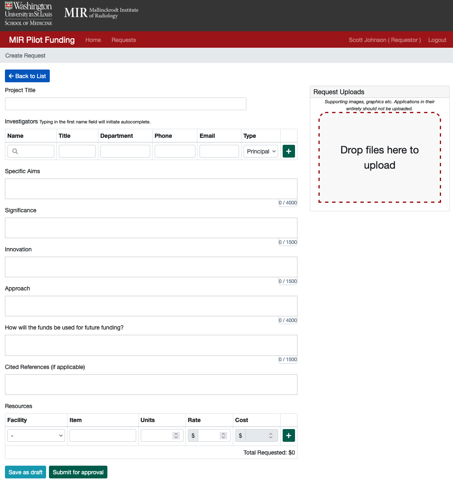

## Applying for pilot funding
Whether you are in MIR or not, one of the best ways to get your project started or get initial data for a study is to apply for MIR Pilot Funding.
* Application at [https://rad-apps.mir.wustl.edu/pilotfunding](https://rad-apps.mir.wustl.edu/pilotfunding)
* More details at [the MIR core resources page](https://www.mir.wustl.edu/research/core-resources/pilot-funds/)
* As of 2024, up to $15,000 per application from MIR Pilot Funds. Another $5,000 is available from [ICTS JIT](https://icts.wustl.edu/funding/just-in-time-jit/) for a total of $20,000 maximum.

### Tips
* Review the rate sheets (linked at the top of [here](faqs-accounting.md)) to help populate the line items in the "Resources" section; having detailed and justified expenses will greatly facilitate your application!
* Please add your total budget (even if it exceeds the grant limits); the MIR Pilot Fund award assessment may assume $5,000 of the presented budget will be paid for by ICTS, so the budget considered for award under the MIR Pilot Fund may be reduced accordingly.

