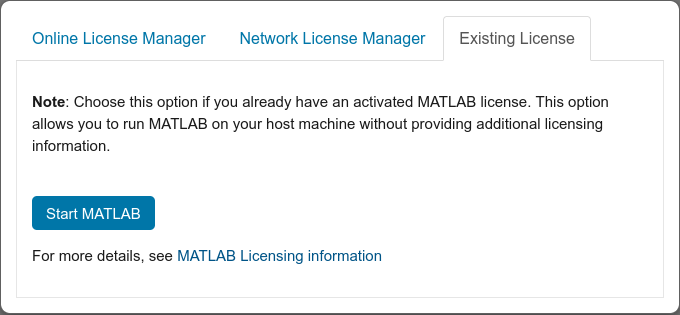

[MATLAB](https://www.mathworks.com/) is a popular programming and numeric computing platform. Matlab is available to cluster users via cluster-wide parallel license.

> Note: Interactive MATLAB may only allow running serial jobs with one CPU core. If you need to run parallel jobs, use the [MATLAB Parallel Server](matlabparallelserver.md).

## Terminal Interface

Log into the cluster and start an interactive job on a compute node using [`srun`](https://slurm.schedmd.com/srun.html). Here we ask for 4 GB of memory, which should be enough for basic Matlab work, and 3 hours of runtime, which is the maximum allowed under the free tier. We ask for an interactive bash terminal with `--pty bash`.

```
[localuser@localmachine ~]$ ssh login3.chpc.wustl.edu
Last login: Tue Sep 19 14:15:38 2023 from 10.20.145.192
[clusteruser@login02 ~]$ srun --partition=free --nodes=1 --time=3:00:00 --mem=4GB --pty bash
[clusteruser@node16 ~]$ 
```

Use the slurm module tool to load Matlab. Append this line to your `~/.bashrc` to load Matlab automatically each time you log in.

```
[clusteruser@node16 ~]$ module load matlab
```

For a specific version of Matlab:

```
[clusteruser@node16 ~]$ module avail matlab

--- /opt/modulefiles ---
   matlab/R2021a (L)

[clusteruser@node16 ~] module load matlab/R2021a
```

Then simply run Matlab from the command line.

```
[clusteruser@node16 ~] matlab
MATLAB is selecting SOFTWARE OPENGL rendering.

                            < M A T L A B (R) >
                  Copyright 1984-2021 The MathWorks, Inc.
                 R2021a (9.10.0.1602886) 64-bit (glnxa64)
                             February 17, 2021

 
To get started, type doc.
For product information, visit www.mathworks.com.
 
>> disp 'Hello world!'
Hello world!
>> exit
[clusteruser@node16 ~]
[clusteruser@node16 ~] exit # to shut down your interactive job
```

## Web Application

> Note: You can skip this section if you are planning to install Jupyter [in the next section](#jupyter-notebook). The Jupyter interface includes the Matlab Proxy web application, so you won't have to install it separately.

Matlab has an officially-supported web application, [Matlab Proxy](https://github.com/mathworks/matlab-proxy), that lets you use the familiar Matlab graphical user interface in your browser while running all the computations on the cluster. The web app itself is written in Python. Follow [our documentation](python.md) to set up a miniconda environment, or you can use pip to create a simple virtual environment in the folder `.venv` and install Matlab Proxy like this.

> Note: Folders starting with a `.` are hidden. You can list them using `ls -a`. You don't have to put your virtual environment in a hidden folder -- you can call the folder whatever you want.

```
[clusteruser@node16 ~]$ python -m venv .venv
[clusteruser@node16 ~]$ source .venv/bin/activate
(.venv) [clusteruser@node16 ~]$ pip install --upgrade pip
(.venv) [clusteruser@node16 ~]$ pip install matlab-proxy
```

And to re-enter the virtual environment later, just run:

```
[clusteruser@node16 ~]$ source .venv/bin/activate
(.venv) [clusteruser@node16 ~]$ # now you are in the virtual environment
```

> Note: Some developers prefer to manage packages and virtual environments using [conda](https://docs.conda.io/projects/conda/en/stable/) instead.

From within the virtual environment run the `matlab-proxy-app`. You can find additional usage information [here](https://github.com/mathworks/matlab-proxy#usage).

```
(.venv) [clusteruser@node16 ~]$ env MWI_USE_EXISTING_LICENSE=True matlab-proxy-app

INFO:MATLABProxyApp:Found MATLAB Executable: /export/matlab/Interactive/R2021a/bin/matlab with Root: /export/matlab/Interactive/R2021a
INFO:MATLABProxyApp:
================================

   MATLAB can be accessed at:

   http://localhost:37851

================================
INFO:MATLABProxyApp:!!! Launching MATLAB without providing any additional licensing information. This requires MATLAB to have been activated on the machine from which its being launched !!!
INFO:MATLABProxyApp:Deleting any cached licensing files!
INFO:MATLABProxyApp:Stopped (any running) MATLAB process.
MATLAB is selecting SOFTWARE OPENGL rendering.

                            < M A T L A B (R) >
                  Copyright 1984-2021 The MathWorks, Inc.
                  R2021a (9.10.0.1602886) 64-bit (glnxa64)
                             February 17, 2021
 
To get started, type doc.
For product information, visit www.mathworks.com.

>>
```

Take note of the port number in the access URL and what compute note you are running on. In this example it's port 37851 on node16. From your local computer, set up an ssh tunnel:

```
[localuser@localmachine ~]$ ssh -L 37851:node16:37851 login3.chpc.wustl.edu
[clusteruser@login02 ~]$ # use Matlab
[clusteruser@login02 ~]$ exit # close the tunnel when finished
```

Once the Matlab Proxy app is running and you have a tunnel set up, copy and paste the access URL into your local computer's web browser. You may have to change `localhost` to `127.0.0.1`. You should see something like this. You can click the close button on the informational popup and begin working.


The files in the file explorer will all be on the cluster, although you can access files on your local computer using [sshfs and a reverse tunnel](../getting-started/import-export-data.md#sshfs-1). Computation happens on the cluster. You can interact with the Matlab editor, debugger, and graphics just as you would if you were running Matlab on your local computer.


When you are finished, press `Ctrl` + `c` in your interactive compute job to stop the Matlab Proxy app. Then `exit` to end your job.

```
(.venv) [clusteruser@node16 ~]$ exit
```

### Using sbatch

If you prefer, you can dispatch your job using a batch script. Create a slurm script like this one and give it a name like `matlab.sh`. Make the script executable with `chmod u+x matlab.sh`.

```bash
#!/bin/bash
#SBATCH --job-name=matlab
#SBATCH --partition=free
#SBATCH --nodes=1
#SBATCH --time=3:00:00
#SBATCH --mem=4GB
pwd; hostname; date # for logging purposes
module load matlab

source ~/.venv/bin/activate
env MWI_USE_EXISTING_LICENSE=True matlab-proxy-app
```

Submit your job with `sbatch` and then check to see if it is running with `squeue`. Take note of which node it is running on.

```
[clusteruser@login01 ~]$ sbatch matlab.sh
Submitted batch job 4089300
[clusteruser@login02 ~] squeue -u clusteruser -t running
JOBID      PARTITION    NAME        USER           ST    TIME    NODES    NODELIST(REASON)
4089300    free        interact    clusteruser    R     0:10    1        node15
```

Inspect the job's slurm output to get the URL to connect to the Matlab Proxy app. Note the port number in the URL.

```
[clusteruser@login02 ~]$ egrep -o 'http(s)?://[a-zA-Z0-9.]+:[0-9]+' slurm-4089300.out 
http://localhost:37851
```

Open an ssh tunnel to the appropriate compute node and port.


```
[localuser@localmachine ~]$ ssh -L 37851:node15:37851 login3.chpc.wustl.edu
[clusteruser@login02 ~]$ # use Matlab
[clusteruser@login02 ~]$ exit # close the tunnel when finished
```

Copy and paste the access URL into your local web browser. End the job when you are finished using Matlab.

```
[clusteruser@login01 ~]$ scancel 4089300
```

## Jupyter Notebook

[Jupyter](https://jupyter.org/) is a web app for interactive notebooks containing both code and code output, such as matrices and plots. Jupyter was originally written for Python code, but there is an officially-supported Matlab kernel as well. Think of it as a `*.m` script you can step through one code block at a time, saving the outputs to review later and regenerate with just one click.

To use the Jupyter Matlab kernel, follow our instructions for [Jupyter](jupyter-notebook.md). Install the `jupyter-matlab-proxy` package. For example, using a virtual environment and pip:

```
[clusteruser@node31 ~]$ source .venv/bin/activate
(.venv) [clusteruser@node16 ~]$ pip install jupyter-matlab-proxy
```

Start the Jupyter Lab server and connect to it in your web browser as usual. You should see something like this.


Clicking `Open MATLAB` will open a new browser tab with the Matlab Proxy web application, the same one you can install standalone (without Jupyter) in the [previous section](#web-application). Clicking `MATLAB Kernel` will open a new Jupyter notebook (`*.ipynb` file) with a Matlab kernel. You can write code blocks in Matlab and run them just as you would a Python-based notebook.


If you see a prompt like this, select the `Existing License` tab and then click `Start MATLAB`.



## See Also

- [Importing and Exporting Data](../getting-started/import-export-data.md) from outside the cluster. In particular, see the section on [using sshfs](../getting-started/import-export-data.md#sshfs-1), [from a worker node](../getting-started/import-export-data.md#controlling-transfers-using-a-worker-node), to mount your local computer as a network filesystem on the cluster.

## X11 Forwarding

We *do not* recommend using the Matlab graphical user interface with X11 forwarding due to performance, reliability, and stability issues. Instead, consider using the web application or Jupyter notebook interface above. 

```
[clusteruser@login01 ~]$ srun --partition=free -N 1 -n 8 --time=04:00:00 --pty --x11 bash
[clusteruser@node01 ~]$ module load matlab
[clusteruser@node01 ~]$ matlab
MATLAB is selecting SOFTWARE OPENGL rendering.
```