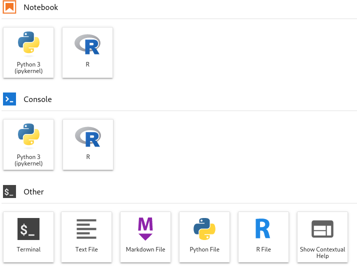

The R home page is [https://www.r-project.org/](https://www.r-project.org/).

## Quick Start

R is installed on the cluster, and can be loaded with `module load R`. For example, to start an interactive job on the cluster and run R on the terminal:

```
[localuser@localmachine ~]$ ssh login3.chpc.wustl.edu
Last login: Tue Sep 19 14:15:38 2023 from 10.20.145.192
[clusteruser@login02 ~]$ srun --partition=free --nodes=1 --time=3:00:00 --mem=4GB --pty bash
[clusteruser@node16 ~]$ module load R
[clusteruser@node16 ~]$ R
R version 4.3.2 (2023-10-31) -- "Eye Holes"
...
> print("Hello world!");
[1] "Hello world!"
> q()
Save workspace image? [y/n/c]: n
[clusteruser@node16 ~]$ exit
[clusteruser@login02 ~]$
```

## Jupyter Notebook

Please use Jupyter from a compute node, not a login node. Follow the [directions to install Jupyter](jupyter-notebook.md). If you are using a python or conda virtual environment, activate it. In this example we are working inside a python virtual environment. The command `IRkernel::installspec()` installs the R Jupyter kernel. We will also need to make sure the `Cairo` package is installed (see below).

```
[clusteruser@node16 ~]$ R
R version 4.3.2 (2023-10-31) -- "Eye Holes"
> install.packages(c("Cairo", "IRkernel"))
Warning:
  'lib = "/export/R/4.3.2/lib64/R/library"' is not writable
Would you like to use a personal library instead? (yes/No/cancel) yes
Would you like to create a personal library
‘/ceph/chpc/home/clusteruser/R/x86_64-pc-linux-gnu-library/4.3’
to install packages into? (yes/No/cancel) yes
--- Please select a CRAN mirror for use in this session ---
Secure CRAN mirrors 

 1: 0-Cloud [https]
 ...
 71: USA (MO) [https]

Selection: 71
... 
* installing *source* package ‘IRkernel’ ...
** package ‘IRkernel’ successfully unpacked and MD5 sums checked
** using staged installation
** R
** inst
** byte-compile and prepare package for lazy loading
** help
*** installing help indices
** building package indices
** testing if installed package can be loaded from temporary location
** testing if installed package can be loaded from final location
** testing if installed package keeps a record of temporary installation path
* DONE (IRkernel)

The downloaded source packages are in
	‘/tmp/RtmpaqC0Fx/downloaded_packages’
> library(IRkernel)
> IRkernel::installspec()
> q()
Save workspace image? [y/n/c]: n
[clusteruser@node16 ~]$
```

Next, edit `~/.Rprofile` and add the following. Run `install.packages("Cairo")` if you have not already done so above. See [IRkernel #388](https://github.com/IRkernel/IRkernel/issues/388) for an explanation of why this step is needed.

```
## Set default 'type' for png() calls - useful when X11 device is not available!
## NOTE: Needs 'cairo' capability
options(bitmapType='cairo')
```

Then follow the [directions to start and connect to your Jupyter server](jupyter-notebook.md). Before starting the server, make sure you `module load R` in your shell. You should see the following in your Jupyter launcher:



## Using Conda

To use development versions of R, or to customize your R installation, you’ll want to use Anaconda distributions (see [Python](python.md) for instructions on how to setup your conda environment), which come pre-bundled with many R packages. Regardless of which R package you use, you need to set up a R environment similar to Python Virtual Environment using conda command. This will allow you to update or install any packages that you’d like.

You can now create a R environment with:

```
[me@login01 ~]$ conda create -n <name_of_env> <r_package_needed>
```

where can be whatever you want to call it.

To activate this environment, use:

```
[me@login01 ~]$ source activate <name_of_env>
```

To activate this environment, use:

```
[me@login01 ~]$ conda deactivate
```

To install R packages within this environment, you can start R, and then use “install.packages()” command.

An example of creating a new R environment is shown here:

```
[me@login01 ~]$ conda create -n r-env r-essentials r-base
[me@login01 ~]$ source activate r-env
(r-env) [me@login01 ~]$ R

R version 3.6.1 (2019-07-05) -- "Action of the Toes"
Copyright (C) 2019 The R Foundation for Statistical Computing
Platform: x86_64-conda_cos6-linux-gnu (64-bit)

R is free software and comes with ABSOLUTELY NO WARRANTY.
You are welcome to redistribute it under certain conditions.
Type 'license()' or 'licence()' for distribution details.

  Natural language support but running in an English locale

R is a collaborative project with many contributors.
Type 'contributors()' for more information and
'citation()' on how to cite R or R packages in publications.

Type 'demo()' for some demos, 'help()' for on-line help, or
'help.start()' for an HTML browser interface to help.
Type 'q()' to quit R.

> install.packages('mice')
> library(mice)
> quit()
Save workspace image? [y/n/c]: n

(r-env) [me@login01 ~]$ conda deactivate
[me@login01 ~]$
```

As you don’t have permission to write to the system temporary directory, when you install R packages in your R environment, you may encounter an error like:

```
ERROR: 'configure' exists but is not executable -- see the 'R Installation and Administration Manual'
```

To solve this issue, you need to create a temporary directory in a folder where you have full permission, for instance, your scratch folder. Then, you set TMPDIR variable to this temporary directory.

```
[me@login01 ~]$ mkdir /scratch/me/tmp
[me@login01 ~]$ chmod 755 /scratch/me/tmp
[me@login01 ~]$ export TMPDIR=/scratch/me/tmp
```

After this, you can start R and install packages within as the new temporary directory is writable and executable by you.

```
> tempdir()
[1] "/scratch/me/tmp//RtmpXbI3Sg"
```

You can also use conda command **conda install -c r package-name** to install R packages given they are available in the Anaconda repository. A complete list of these packages can be found [here](https://docs.anaconda.com/anaconda/packages/r-language-pkg-docs/).

```
(r-env) [me@login01 ~]$ conda install -c r r-bayesm
(r-env) [me@login01 ~]$ R
> library(bayesm)
```
