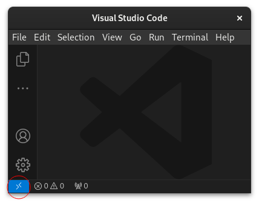
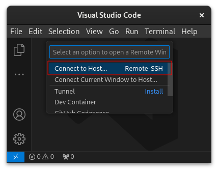
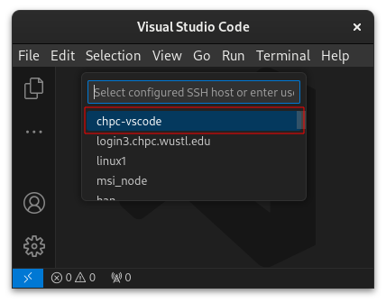
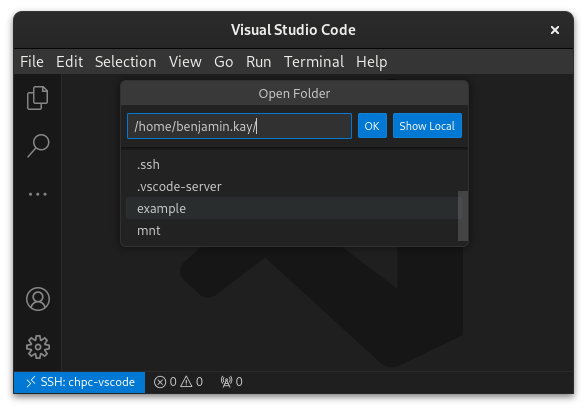
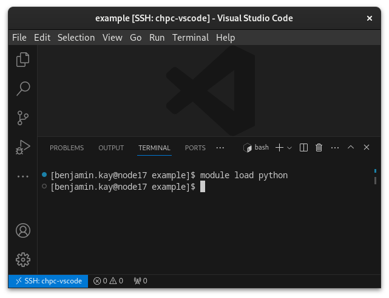
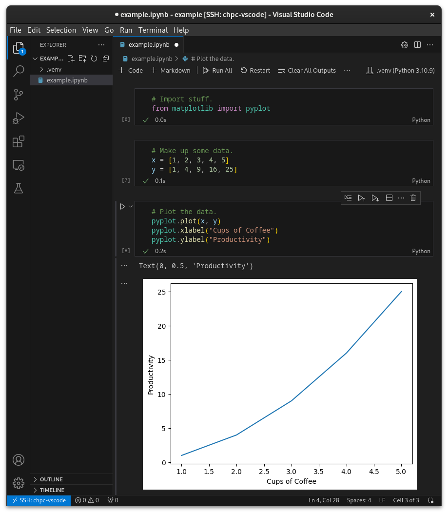

[Visual Studio Code](https://code.visualstudio.com/) is a popular, free, and multi-platform (including Linux) IDE supported by Microsoft. It has an officially-supported [remote development extension](https://code.visualstudio.com/docs/remote/ssh) that allows you to write, compile, run, test, and debug code on the cluster from the comfort of your local computer. Remote development is particularly handy if compilation or testing would take a long time on your laptop. It is also very convenient for developing batch jobs to run on the cluster.

## Setting Up a Compute Node

Log into the cluster and use [`salloc`](https://slurm.schedmd.com/salloc.html) to request an interactive job with reasonable resources. Here we ask for 4 GB of memory, which should be enough for most development tasks, and 3 hours of runtime, which is the maximum allowed under the free tier. Take note of which node the job runs on.

> Note: VS Code's remote development extension works over SSH. At the time of this writing, the only compute node you can SSH into is node17. Request node17 specifically using `salloc -w node17`

```
[localuser@localmachine ~]$ ssh login3.chpc.wustl.edu
Last login: Tue Sep 19 14:15:38 2023 from 10.20.145.192
[clusteruser@login02 ~]$ salloc -w node17 --nodes=1 --time=3:00:00 --mem=4GB --qos=interactive
salloc: Nodes node17 are ready for job
[clusteruser@node17 ~]$ 
```

You can also figure out which compute node your job is running on with [`squeue`](https://slurm.schedmd.com/squeue.html).

```
[clusteruser@login02 ~] squeue -u clusteruser -t running
JOBID      PARTITION    NAME        USER           ST    TIME    NODES    NODELIST(REASON)
4074089    small        interact    clusteruser    R     7:58    1        node17
```

And when you are finished working, you can cancel the job.

```
[clusteruser@login02 ~] scancel 4074089 # use job id from squeue
```

## Setting Up Visual Studio Code

> Note: VS Code has a little bit of trouble with Slurm's module system. Append the following to your `~/.bashrc` on the cluster:
>
> ```
> export MODULEPATH=$MODULEPATH:/opt/modulefiles
> ```

Follow instructions to install [VS Code's remote development over SSH extension](https://code.visualstudio.com/docs/remote/ssh). Pick a port on your local computer other than 22 to tunnel to VS Code's remote development server on the cluster. In this example we'll use local port 2222. To tell VS Code about the connection, edit `~/.ssh/config` on your local computer and add a host for the cluster. You can name the host whatever you want -- here we'll call it `chpc-vscode`.

```
Host chpc-vscode
  Hostname 127.0.0.1            
  User clusteruser
  IdentityFile ~/.ssh/chpc_rsa
  Port 2222
```

Note that you *must* set up public key authentication as described [here](../getting-started/connect-to-login-nodes.md#entering-my-password-to-login-every-time-is-so-annoying--how-can-i-connect-to-the-cluster-without-entering-the-password). Password authentication is *not* allowed on the compute nodes. In this example, our private key is stored in `~/.ssh/chpc_rsa` on our local computer.

Next, create a tunnel from your local computer to the compute node running your interactive job via a login node. In this example we tunnel local port 2222 to port 22 on compute node17.

 ```
[localuser@localmachine ~]$ ssh -L 2222:node17:22 login3.chpc.wustl.edu
 ```

Now you are ready to connect to the compute node using VS Code.

## Remote Development on a Compute Node

Assuming you've already installed the [remote extension](https://code.visualstudio.com/docs/remote/ssh), when you start VS Code you should see something like this.



Click on the blue connection icon at the bottom left of the screen and then click on Connect to Host...



Click on the profile you added to `~/.ssh/config`. The first time you connect VS Code will take a minute to install its lightweight server in your home folder on the cluster. Subsequent connections should establish themselves more quickly.



Once connected, you can use `File > Open Folder...` to browse for a project folder to open on the cluster's filesystem.



Commands run in the VS Code terminal will run on the compute node. For example, suppose you are a Python developer. You can run `module load python` in the VS Code terminal, or append it to your `~/.bashrc` on the cluster to run it automatically each time you log in.



You can even use VS Code for interactive debugging, for example, using a [Jupyter notebook](https://code.visualstudio.com/docs/datascience/jupyter-notebooks) or [Python code cells](https://code.visualstudio.com/docs/python/jupyter-support-py). The Jupyter kernel will run on the compute node. See the tutorial for [Jupyter](jupyter.md) for more information.



## Running VS Code Directly on a Compute Node

While it is advisable to run Visual Studio Code locally and use the remote extension to interact with the cluster, it is also possible to run VS Code directly on a compute node using X11 forwarding over an SSH tunnel. We *do not recommend* doing this due to latency, reliability, and compatibility issues with X11 forwarding.

Configure the cluster for X11 forwarding if you have not already done so.

```
[clusteruser@login02 ~] echo "export XDG_RUNTIME_DIR=$HOME/.runtime-dir" >> ~/.bashrc
[clusteruser@login02 ~] mkdir -p ~/.runtime-dir
[clusteruser@login02 ~] chown $USER ~/.runtime-dir
[clusteruser@login02 ~] chmod 700 ~/.runtime-dir
```

Request an interactive job on the compute node and set up a tunnel with X11 forwarding to that node. Then you should be able to launch VS Code by running the `code` command on the compute node.
