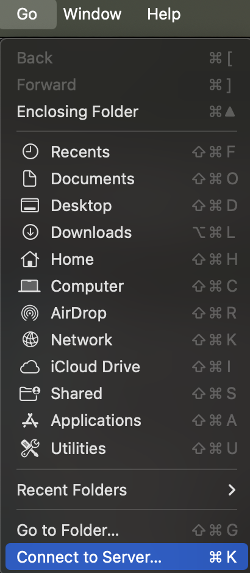

## 1. Creating a VNC Password
You will first need to create a password for VNC connection on both login nodes by running `vncpasswd` command:

```
[me@login01 ~]$ mkdir ~/.vnc
[me@login01 ~]$ /opt/TurboVNC/bin/vncpasswd
Password:
Verify:
Would you like to enter a view-only password (y/n): n
A view-only password is not used
```

This is the password you would need to establish the connection via VNC client installed on your local computer.
## 2. Requesting a Displayport
In order to run a VNC remote desktop on the login node, request that an administrator assign you a displayport.

The displayport will have a corresponding port number, which is 5900 + displayport, so if you are assigned "91" the port number to forward would be "5991". You should note the port exclusively assigned to you and use that to connect.
## 3. Forwarding the VNC Port
Once you have an assigned VNC displayport on the login node, you can establish the connection to the login node using SSH port-forwarding.

You will need to open a terminal on your local machine. An example of forwarding the port via the terminal is shown below, and please remember to replace both port numbers before and after “localhost” with your exclusively assigned port number. 

Note: the RCIF VNC server only runs on `login01`, so make sure to use the "login3-01" url, e.g.:

```
[other_me@my_local_machine ~]$ ssh -L 5902:localhost:5902 me@login3-01.chpc.wustl.edu
```
(replacing "02" in this example with your assigned port)
## 4. Connecting with a VNC Client
Next, you will need a VNC client to connect to that port. There are several options, but we detail two popular options (MacOS VNC client and RealVNC) below.
### MacOS VNC Client
Once the port is forwarded, if you are on MacOS you can use the simple and effective VNC viewer that is built in.

Open the "Finder" application, then select from the top menu "Go" -> "Connect to Server":


Enter "vnc://0.0.0.0:5902" (replace "02" with your assigned display port) in the drop-down and click the "Connect" button. You may be prompted for a password; enter the one you used in the  `vncpasswd` step at the beginning. Done!
### RealVNC
If you are not on MacOS or want a different client, the Virtual Network Computing ([VNC](https://www.realvnc.com/en/)) is a popular option. You can download and install a version of the VNC client that fits your computer OS from [https://www.realvnc.com/en/connect/download/viewer/](https://www.realvnc.com/en/connect/download/viewer/).
1. After forwarding your VNC port, you can start the VNC client on your local computer.
2. Click on “GOT IT” button, and then click on “File” at the header, and choose “New connection”.
3. After filling out the server (replace the port number with the one exclusively assigned to you) and username (your username to log into the cluster), click “OK” button and you would see a “computer display” shaped icon for you to connect would appear.
4. Right click on the icon and choose “Connect”, that would bring you to a new screen asking your confirmation to connect.
5. Click on “Continue” button, and you would be prompted to enter the password for the connection. The password would be the one you entered after running `vncpasswd`.
6. Click on “OK” button. After you see the following interface, you are connected.
7. Press “Enter” key on your keyboard to log in. This time, the password is the one you would use to log into the login node.
8. You can click on the “Activities” icon at the top-left corner of this screen to do various operations. !

If you need to access your /scratch folder, you can first click on “Files” icon within the left panel (similar to what’s shown in the above image) after clicking “Activities” icon. It would bring up a new window. Then, click on “Other Locations”, it would show a folder named “Computer”.

Click on the folder named “Computer”, it would show all folders mounted on the login node, among which you can find a folder named “scratch”.

Click on the folder named “scratch”, it would show all user folders, find your own and click on it, you would be able to see all files in your scratch space.

## 5. Troubleshooting
VNC can be difficult for users. There are several configuration and connection challenges that can arise. We will build the following list, as we receive user feedback:
### xstartup
You can define how your VNC session starts by writing a `~/.vnc/xstartup`. If this is incompatible, this can cause the screen to show blank but otherwise produce no errors. Check that this is correct.
### Lock Screen
If you leave your window unused, a lock screen can appear. Just run:
```bash
loginctl unlock-session
```
in a terminal under the user running the VNC server and on the server where the VNC server is running.